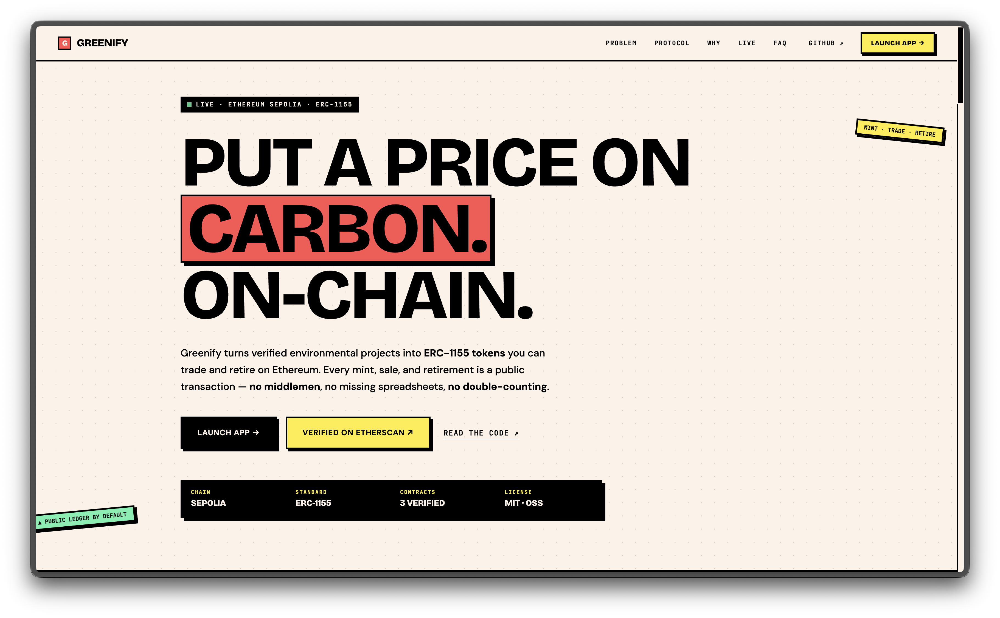
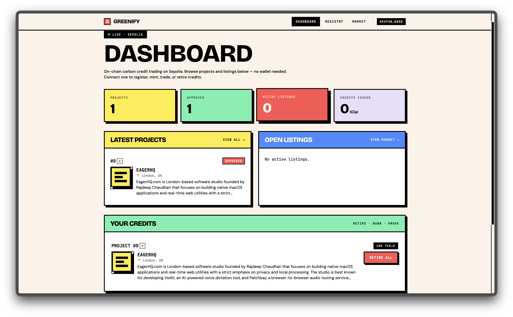
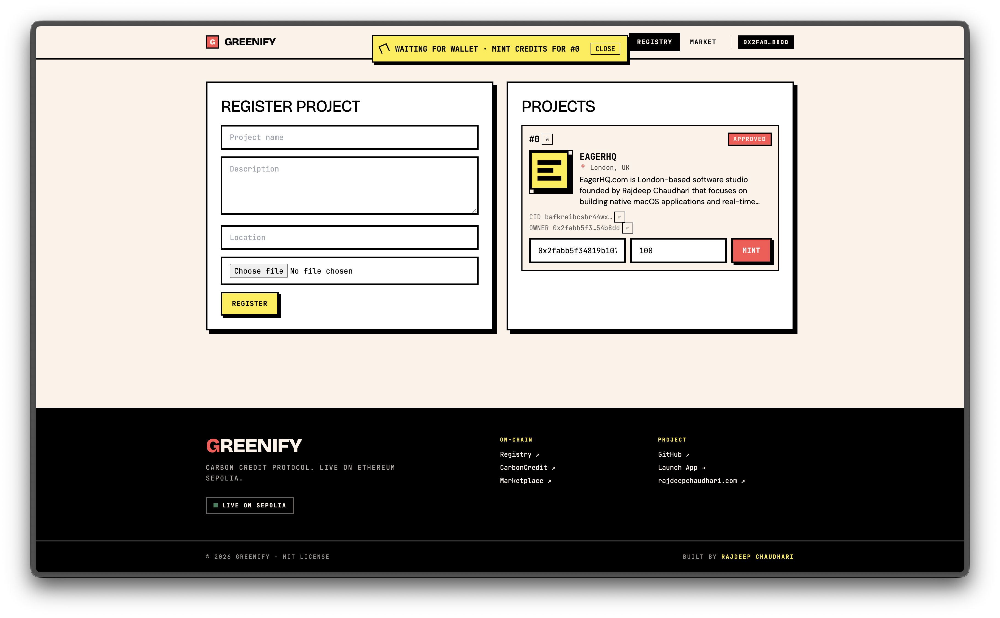
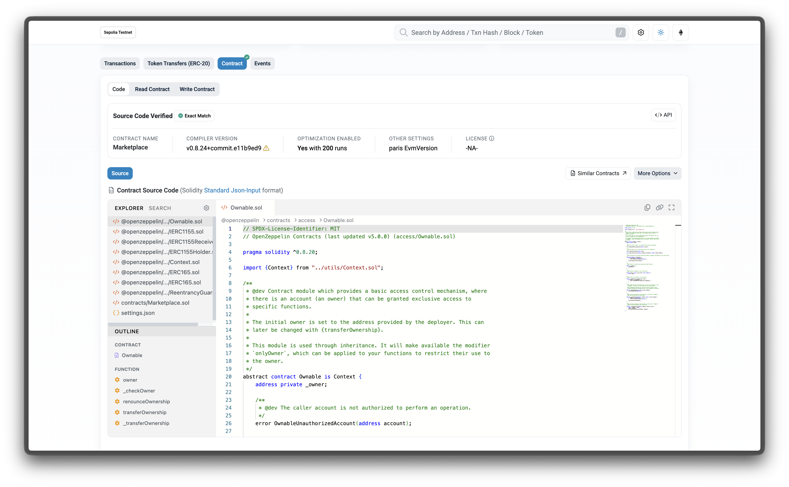
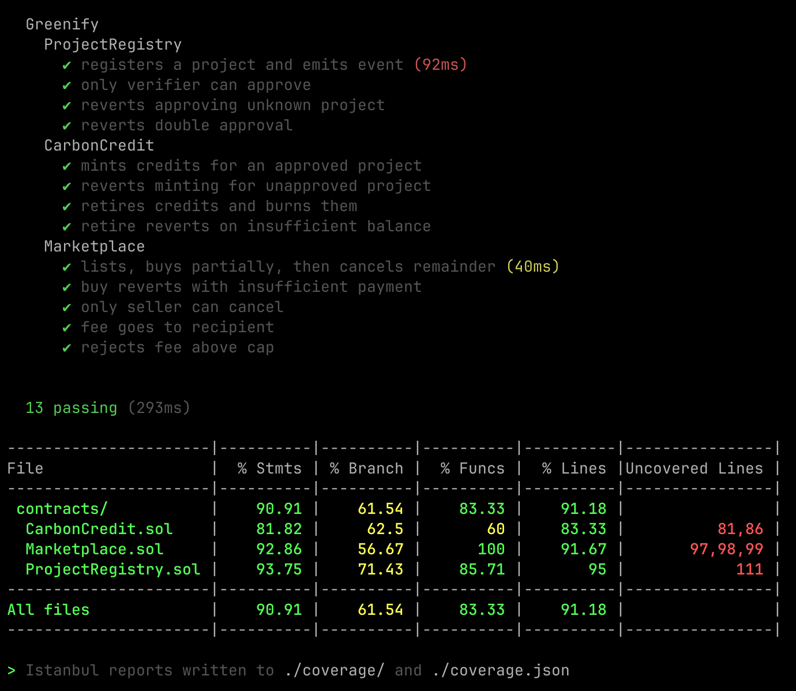

# Greenify

> Carbon credits on a public ledger. Mint. Trade. Retire. All on-chain.

A hybrid DApp for trading tokenised carbon credits on Ethereum. Built as the CN6035 **Mobile and Distributed Systems** Task 1 submission.

[](https://github.com/rajdeepchaudhari-work/Greenify/actions/workflows/ci.yml)


**🔗 Live demo:** [greenifyrc.vercel.app](https://greenifyrc.vercel.app)
**📖 First-time setup:** [`SETUP.md`](./SETUP.md)

---

## What it does

Greenify lets industries and environmental projects trade carbon credits without registries or spreadsheets. A credit is an ERC-1155 token (`1 unit = 1 tonne CO₂e`); every mint, sale, and retirement is a public Ethereum transaction. Anyone can audit the entire supply-chain from a block explorer.

## Screenshots

| Landing page (public, no wallet) | App dashboard (connected)            |
| -------------------------------- | ------------------------------------ |
|  |  |

| Tx banner during mining              | Contract verified on Etherscan       |
| ------------------------------------ | ------------------------------------ |
|  |  |



---

### End-to-end flow

1. **Register** — a project owner pins metadata (+ evidence image) to IPFS and writes the CID on-chain
2. **Approve** — a verifier role signs off on the project, unlocking issuance
3. **Mint** — the verifier mints credits (ERC-1155) against the approved project
4. **Trade** — any holder lists credits on the built-in escrow marketplace; buyers pay ETH
5. **Retire** — holders burn credits to permanently claim the offset; the `CreditsRetired` event is the receipt

---

## Architecture

```
┌──────────────────────────┐          ┌──────────────────────────┐
│   React + Vite SPA       │  /api/*  │  Vercel Serverless       │
│   (Neo-Brutalist UI)     │◄────────►│  - REST endpoints        │
│   ethers.js + MetaMask   │          │  - /api/sync (cron)      │
└──────────────┬───────────┘          │  - Pinata pinning        │
               │  signed tx            │  - MongoDB Atlas cache   │
               ▼                       └──────────────┬───────────┘
        ┌────────────────────────────────────────────┐│
        │  Ethereum Sepolia                          ││
        │  ProjectRegistry ─ CarbonCredit ─ Marketplace
        │          (OpenZeppelin AccessControl)      │◄─ indexer
        └────────────────────────────────────────────┘   JSON-RPC reads
```

| Layer           | Tech                                                          |
| --------------- | ------------------------------------------------------------- |
| Smart contracts | Solidity `0.8.24`, OpenZeppelin 5.0, Hardhat, TypeChain, Chai |
| Serverless API  | `@vercel/node`, Mongoose, Zod, Formidable, pinata-web3        |
| Frontend        | React 18, Vite 5, TailwindCSS 3, ethers v6, React Router 6    |
| Infra           | Vercel (frontend + serverless), MongoDB Atlas M0, Pinata IPFS |
| Quality         | ESLint, Solhint, Prettier, Husky, lint-staged, GitHub Actions |

---

## Repository layout

```
.
├── contracts/             Hardhat project
│   ├── contracts/         ProjectRegistry · CarbonCredit · Marketplace
│   ├── test/              13 Chai tests, 91% coverage
│   ├── scripts/deploy.ts  Deployment + Etherscan verification
│   └── deployments/       Sepolia addresses (committed)
├── frontend/
│   ├── api/               Vercel serverless functions (REST + cron)
│   │   └── _lib/          Shared: mongo, chain, ipfs, models, backfill
│   ├── src/               React app (pages, components, hooks, layouts)
│   ├── public/            Favicons
│   └── vercel.json        Cron + SPA rewrite
├── .github/workflows/     CI: lint, format-check, tests on every push
├── README.md              You are here
├── SETUP.md               Step-by-step first run
└── CHANGELOG.md
```

---

## Deployed contracts (Sepolia, verified)

| Contract                | Address                                      | Etherscan                                                                                             |
| ----------------------- | -------------------------------------------- | ----------------------------------------------------------------------------------------------------- |
| ProjectRegistry         | `0xCC99Ef02ee49bA27AE102B087219892F9eD812e8` | [view source ↗](https://sepolia.etherscan.io/address/0xCC99Ef02ee49bA27AE102B087219892F9eD812e8#code) |
| CarbonCredit (ERC-1155) | `0x02eeBE9DcCC6499a2eaA4C344A1773C3F7606c5B` | [view source ↗](https://sepolia.etherscan.io/address/0x02eeBE9DcCC6499a2eaA4C344A1773C3F7606c5B#code) |
| Marketplace             | `0x62eE925038f472E4E4a9D59B78E1e29A19112486` | [view source ↗](https://sepolia.etherscan.io/address/0x62eE925038f472E4E4a9D59B78E1e29A19112486#code) |

All three are **source-verified** on Etherscan; ABIs and read/write interfaces are browsable without the repo.

---

## REST API

Served by Vercel serverless functions at `/api/*`. Full schemas in [`frontend/api/README.md`](./frontend/api/README.md).

| Method | Path                     | Description                                                 |
| ------ | ------------------------ | ----------------------------------------------------------- |
| GET    | `/api/health`            | Liveness + Mongo ping                                       |
| GET    | `/api/projects`          | All projects, newest first                                  |
| GET    | `/api/projects/[id]`     | One project by id                                           |
| POST   | `/api/projects/metadata` | Pin name/description/image to IPFS via Pinata               |
| GET    | `/api/listings`          | Active marketplace listings (`?active=true`, `?seller=0x…`) |
| GET    | `/api/listings/[id]`     | One listing by id                                           |
| GET    | `/api/sync`              | Incremental event backfill (cron-triggered)                 |

---

## Quick start

First-time setup — see [`SETUP.md`](./SETUP.md) for the hand-held version.

```bash
git clone https://github.com/rajdeepchaudhari-work/Greenify.git
cd Greenify
npm install

# 1. Contracts
cd contracts
cp .env.example .env                 # add RPC, deployer key, Etherscan key
npx hardhat compile
npx hardhat test                     # 13 passing
npx hardhat coverage                 # 91% statements
npm run deploy:sepolia               # writes deployments/sepolia.json

# 2. Frontend (runs api/ + SPA under vercel dev)
cd ../frontend
cp .env.example .env                 # paste contract addresses
npm run dev                          # Vite SPA at :5173
# For full local API + frontend:
npx vercel dev                       # everything at :3000
```

Live sync: cron-job.org → `https://your-deployment.vercel.app/api/sync` every 1 min (free, bypasses Vercel's daily cron limit).

---

## Quality gates

Every push runs GitHub Actions:

```bash
npm run lint              # ESLint on TS/JS (zero warnings allowed)
npm run lint:sol          # Solhint on Solidity
npm run format:check      # Prettier diff check
npm run test:contracts    # Hardhat + Chai
```

Pre-commit hooks (Husky + lint-staged) format and lint changed files automatically.

### Test coverage (Hardhat)

```
File                  |  % Stmts | % Branch |  % Funcs |  % Lines |
----------------------|----------|----------|----------|----------|
 contracts/           |    90.91 |    61.54 |    83.33 |    91.18 |
  CarbonCredit.sol    |    81.82 |    62.50 |    60.00 |    83.33 |
  Marketplace.sol     |    92.86 |    56.67 |   100.00 |    91.67 |
  ProjectRegistry.sol |    93.75 |    71.43 |    85.71 |    95.00 |
----------------------|----------|----------|----------|----------|
```

---

## Design decisions

Headlines (full rationale in the submitted technical report):

- **ERC-1155 over ERC-20/721** — one contract, many project batches, each fungible internally (preserves provenance without per-credit NFT overhead)
- **AccessControl verifier role** — approval and issuance gated behind a revocable role; admin can rotate it. In production would be a multisig
- **Escrowed marketplace with reentrancy guard** — checks-effects-interactions on buys, sellers deposit credits up-front so there's nothing to rug
- **Polling indexer with checkpoint** — serverless can't keep WebSocket subscriptions; every run reads the last-processed block from Mongo and `eth_getLogs`-scans in 45k-block chunks (under public-RPC's 50k cap)
- **Public read, wallet-gated write** — visitors can browse everything without installing a wallet; write actions show an Install Wallet card if no provider is detected
- **Neo-Brutalist design system** — thick black borders, hard offset shadows, monospace display, high-contrast palette. Accessible by default, distinctive by choice

---

## Security considerations

- All three contracts use **custom errors** (gas-efficient + specific), not string reverts
- `Marketplace.buy` follows **checks → effects → interactions** strictly
- `ReentrancyGuard` on `buy`/`cancel`
- Protocol fee hard-capped at **10% (1000 bps)** in the constructor and in `setFee`
- Verifier role (capable of approving fraudulent projects) is **revocable** by the admin; the admin should be a multisig in production
- Pinata JWT and deployer private keys live only in environment variables — `.env` is gitignored across all three workspaces
- Backend endpoints validate request bodies with **Zod**; uploaded images are capped at 4 MB

Known limitations:

- A compromised verifier can approve arbitrary projects (mitigated in production via multisig)
- IPFS pins depend on Pinata availability; pinning to a second gateway would improve durability
- Real-world MRV (measurement, reporting, verification) is out of scope for this coursework deliverable

---

## Acknowledgements

Built by [Rajdeep Chaudhari](https://rajdeepchaudhari.com) for CN6035. Smart-contract scaffolding uses [OpenZeppelin Contracts](https://github.com/OpenZeppelin/openzeppelin-contracts). Design language takes cues from the neo-brutalist web movement.

## License

MIT — see [LICENSE](./LICENSE) (if present) or the `license` field in `package.json`.
